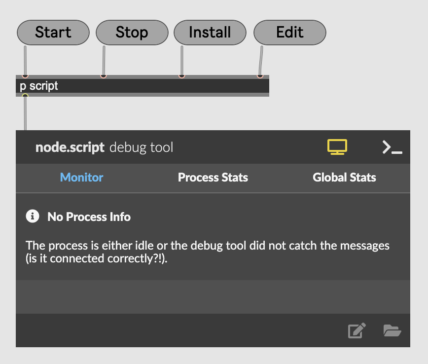

# frost-osc

Se også:
* [Testprogrammer](./frost-osc-max/testers/doc/README.md)

## Oppsett og første gangs kjøring

### Installer Max

Last ned Max fra denne siden:
 * https://cycling74.com/downloads

Max fungerer som fullversjon i 30 dager. Etter det kan man ikke lagre endringer på max- programmer. Det er helt OK.

For å kjøre dette programmet trenger man ikke lagre endringer. Man kan derfor bruke gratisversjonen for å kjøre frost-osc.

### Opprett bruker på Frost API

Følg disse instruksjonene på denne siden: 
* https://frost.met.no/auth/requestCredentials.html


Noter ned "Client Id" og "Client Secret" på et sikkert sted. Du vil trenge disse senere.

### Last ned og start frost-osc

* Gå til https://github.com/badeand/frost-osc
* Klikk Code -> Download Zip
* Pakk ut zip- filen
* Åpne katalogen der filen ble zippet ut, f.eks ```/Users/brukernavn/Downloads/frost-osc-main```

Dobbelklikk på filen ```frost-osc-runner.maxproj```som ligger i katalogen ```frost-osc-runner```:

```

├── frost-osc-main
│   └── frost-osc-max
│       └── frost-osc-runner
│           └── frost-osc-runner.maxproj        <---
```

Programmet skal nå starte og ser ca. slik ut:



### Legg inn nøkler fra Frost API

Klikk på ```Edit```. En tekstfil åpnes.

Se etter disse linkene:

```
let clientId = "x";
let clientSecret = "x";
```

Legg inn nøklene du mottok fra Frost istedenfor "x", f.eks:

```

let clientId = "7d0abdg-74af-5dfg-3sdf-12dgtfdfgdgfh";
let clientSecret = "97fasdf-23df-4d7a-2sdf-128dfheudfdf";

```

Lukk filen og velg å lagre den.

### Installer biblioteker

Klikk på ```Install```

Du skal se blå tekst med "NPM Command Running", og deretter grønn tekst med "NPM Running Success"

### Start programmet

Klikk ```Start```

Du skal se grønn tekst: "Process Running"

Programmet laster jenvlig ned data fra Frost og videresender på OSC.
