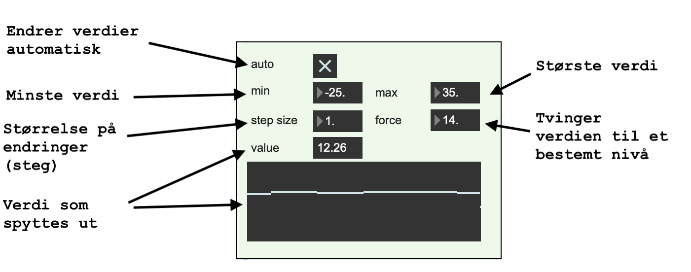

# Testers

### Testprogram for klient

Dobbeltklikk på ```osc_client_tester.maxpat```

```
└── frost-osc-max
    └── testers
        └── osc_client_tester.maxpat      <---

```

Programmer demonstrerer mottak av OSC- meldinger

### Testprogram for avsender

Dobbeltklikk på ```osc_client_tester.maxpat```

```
└── frost-osc-max
    └── testers
        └── sender-tester 
           └── sender-tester.maxproj      <---

```


Programmet sender data ```air_temperature```, ```wind_speed``` m.m. ved jevne mellomrom. Det gjør det enklere å lage mottaksprogrammer


